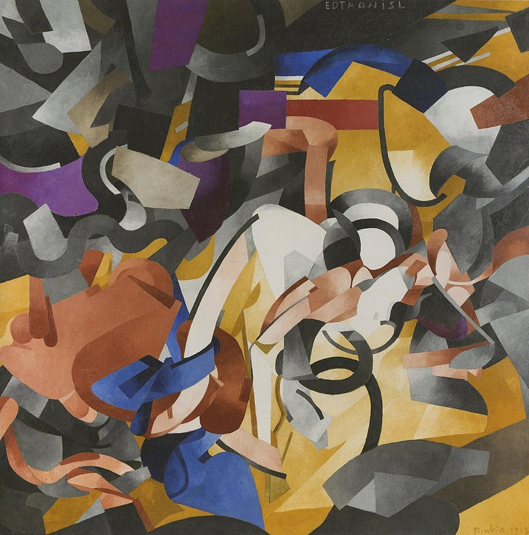
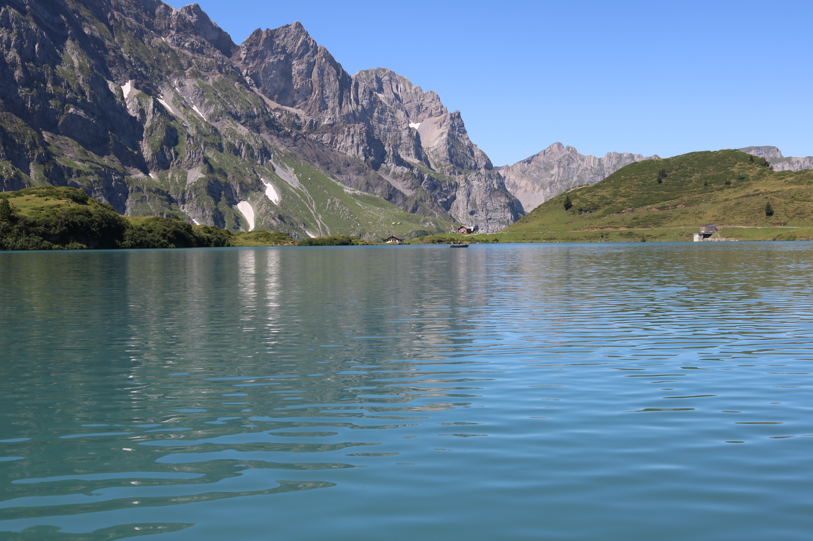
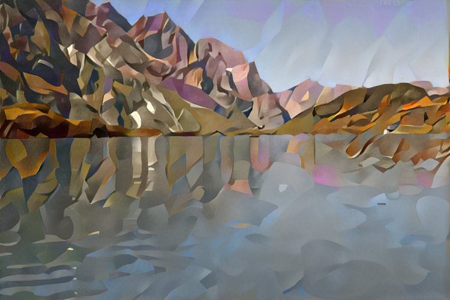
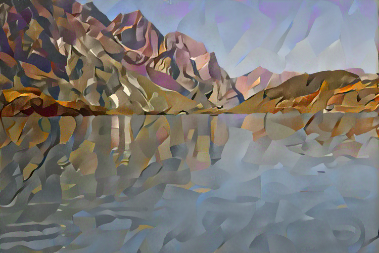
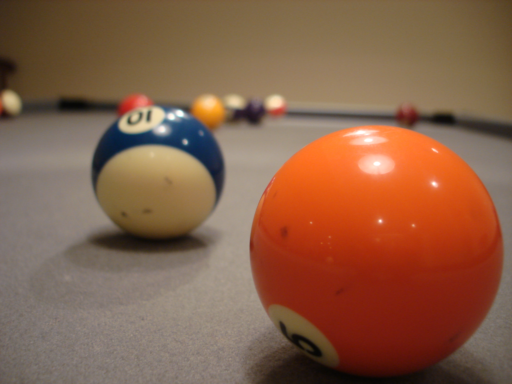
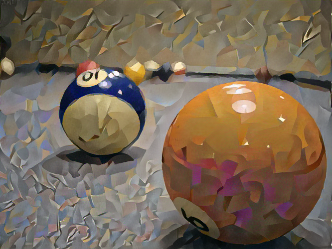
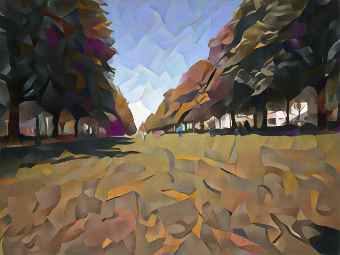

# Style-Transfer
Neural Style Transfer model using pre-trained VGG19, for creating art like images

### Style Input

### Stylized Mountains
 

### Noisy Stylization
 

### Indoor Image Stylization
 

### Outdoor Image Stylization
 
